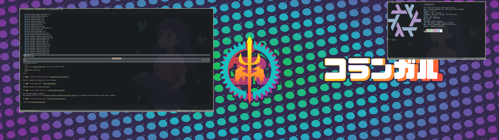
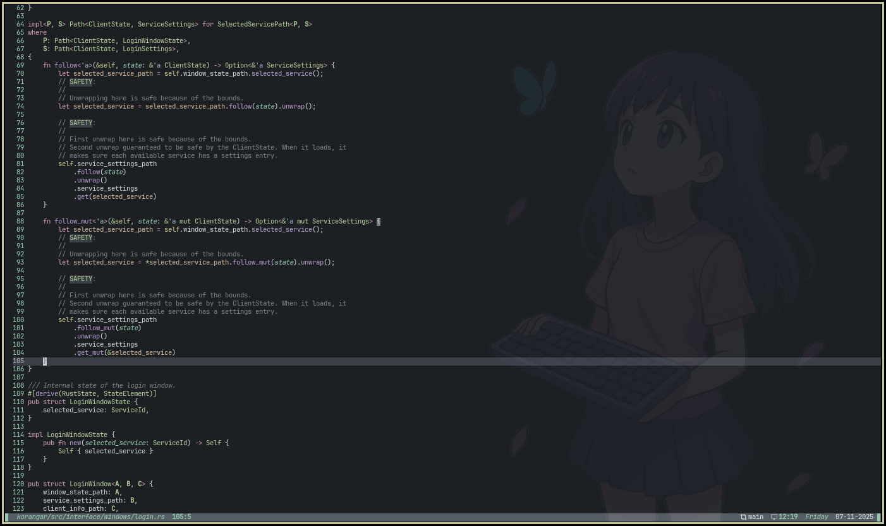

<h1 align="center">
   
  
   
  Repository structure
   
</h1>

### 📂 [`hardware-configuration/`](hardware-configuration/)

NixOS `hardware-configuration` per machine.

### 📂 [`home-assistant/`](home-assistant/)

ESPHome devices for Home Assistant.

### 📂 [`home-manager-modules/`](home-manager-modules)

All my home-manager modules.
The modules use [nix-colors](https://github.com/Misterio77/nix-colors) to provide unified theming for my entire system.

### 📂 [`neovim-configuration/`](neovim-configuration/)

Check [neovim-configuration/README.md](neovim-configuration/README.md) for more information.

### 📂 [`nixos-modules`](nixos-modules/)

NixOS modules.

### 📂 [`secrets/`](secrets/)

Secrets encrypted with [agenix](https://github.com/ryantm/agenix).

### ❄️ [`flake.nix`](flake.nix)

Imports from all other directories to define all my machines and devices.
It uses [Colmena](https://github.com/zhaofengli/colmena) to deploy to all my NixOS machines and provides scripts to build and deploy my smart home devices.
I am also running some [Yggdrasil](https://github.com/yggdrasil-network/yggdrasil-go) nodes to provide deterministic IP addresses to machines, regardless of how they are connected to the network.

#### Central server

The heart of my infrastructure is my central server.
It acts as a DNS and DHCP server and hosts a couple of services for things like network storage and home automation.
