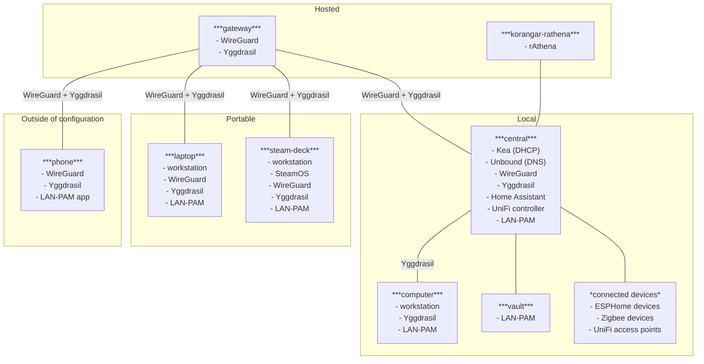

<h1 align="center">
   
  
   
  Repository structure
   
</h1>

### 📂 [`hardware-configuration/`](hardware-configuration/)

NixOS `hardware-configuration` per machine.

### 📂 [`home-assistant/`](home-assistant/)

ESPHome devices for Home Assistant.

### 📂 [`home-manager-modules/`](home-manager-modules)

All my home-manager modules.
The modules use [nix-colors](https://github.com/Misterio77/nix-colors) to provide unified theming for my entire system.
[`base.nix`](home-manager-modules/base.nix) is the common subset of all my NixOS users.

### 📂 [`neovim-configuration/`](neovim-configuration/)

Check [neovim-configuration/README.md](neovim-configuration/README.md) for more information.

### 📂 [`nixos-modules`](nixos-modules/)

NixOS modules.
My goal for the modules is to provide an abstraction that makes it easy to configure many machines and painlessly add new ones.
[`base.nix`](nixos-modules/base.nix) is the common subset of all my NixOS machines.

### 📂 [`secrets/`](secrets/)

Secrets encrypted with [agenix](https://github.com/ryantm/agenix).

### ❄️ [`flake.nix`](flake.nix)

Imports from all other directories to define all my machines and devices.
It uses [Colmena](https://github.com/zhaofengli/colmena) to deploy to all my NixOS machines and provides scripts to build and deploy my smart home devices.
Also contains some cool ASCII art.

### Notable

- All my NixOS machines are set up for a single user account
- I'm using the experimental Nix pipe operator (`|>`).
- Declarative WireGuard setup using NetworkManager
- [LAN-PAM](https://github.com/vE5li/lan-pam) for authenticating using my phone (see [lan-pam.nix](nixos-modules/lan-pam.nix))
- Private Yggdrasil network to give friends access to my home server

### Infrastructure diagram

